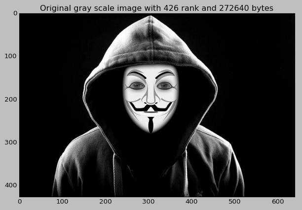
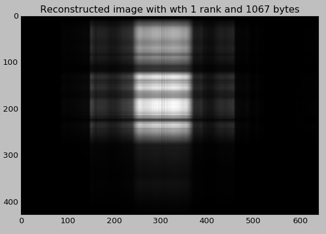
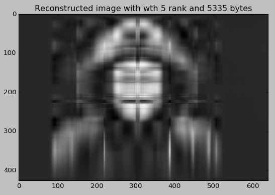
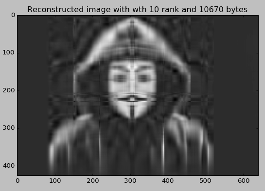
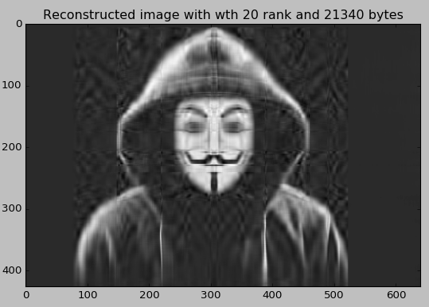
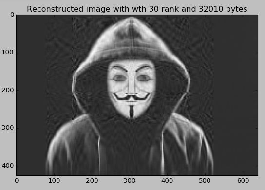
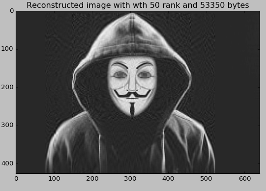
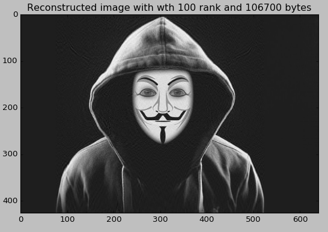
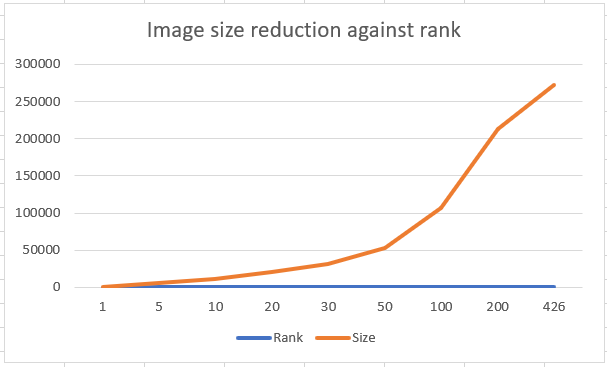

# Application of Linear Algebra

In this Linear Algebra project, an attempt is made to explore the idea of image size reduction with the application of SVD.

## Example 
python3 img_comp_svd.py ./imgs/hacker_640x426.jpg 10

## Results

 
  
 
  
 

### Chart showing the size against rank

